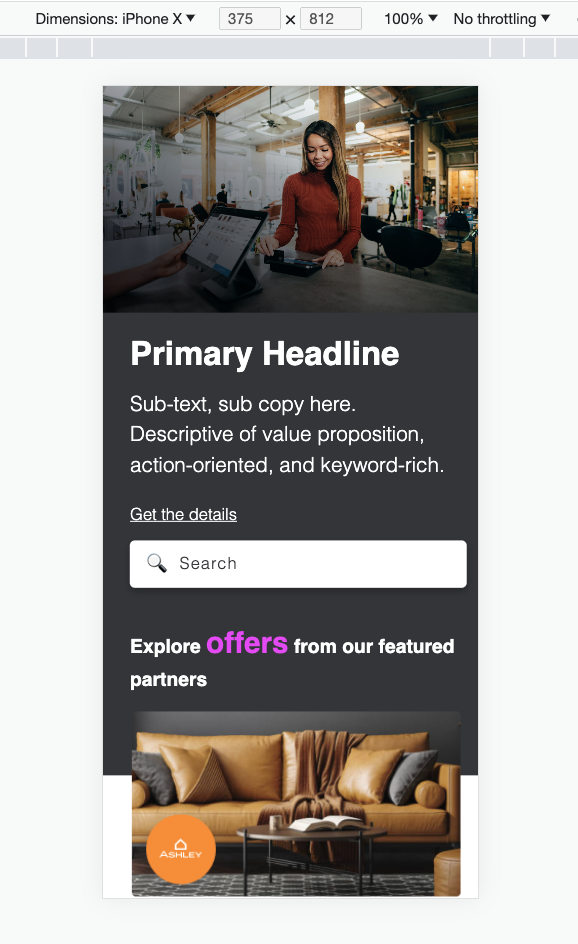

# vanilla-mockup
## Overview of HERO image modal
####Time Spent
  * Roughly 3.5 hours

This project is featuring a code snippet for a Hero Image modal, built to design/wireframe specs. The advertising tiles are dynamically inserted, pulling specific data from a JSON file. The thought process for this was to avoid hard-coding repetitive data into html, as well, updates made to JSON can be done easier, much faster and would allow for improved maintenance and scalability.

In my SCSS I separated out the most common changes into partials so the fonts/colors could be easily updated based on branding. Using SCSS allowed me to use variables for these common and repetive elements as well, such as using $main-color or $accent-color to allow more modularized code that can be customized across various projects. 

## Module Preview

## Live Site  in Pages
[Vanilla Mockup](https://azufelt.github.io/vanilla-mockup/)

## Given more time I would:
 If this were a feature going into production, and I had more time to polish it, some things I would address are:
  * Continuing to Refactor the code to optimize further variables, consolidated mixins, and leveraging @extend classes in my markup.
  * Add additional @media queries so it is looking great at all screen sizes. This project was optimized for mobile & desktop only. 

## Some items of Uncertainty:
 Being unable to thoroughly communicate with the designer on the required specs, some items I was unsure about were:
  * Some of the labeling on the wireframe; What was referenced was a Sub Headline, what was shown appeared more like 
 text. I would have wanted to change it based on visual heirarchy that also maintains Accessibility heirarchy requirements. 
  * It drove me nuts hot having the exact icons, because it caused some of the spacing and font-size specs to appear off. 

## Development Environment

*VS Code
*HTML5
*CSS
*JavaScript
*SCSS

*Font Awesome Icons
*Google Fonts